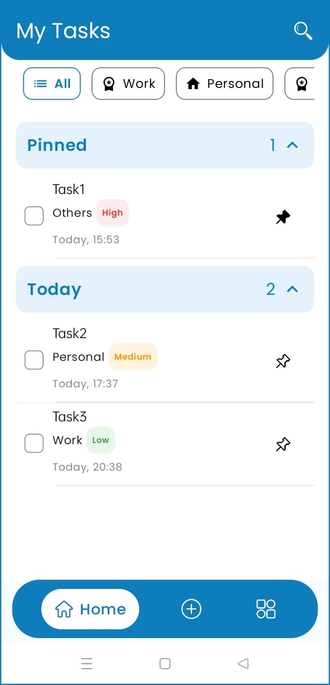
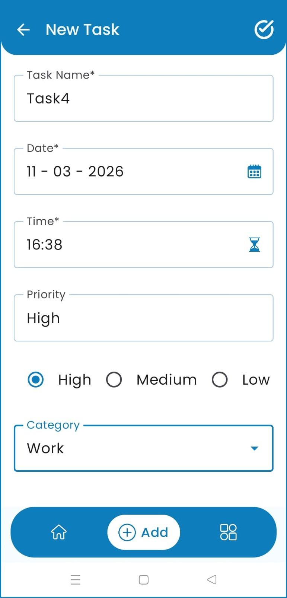
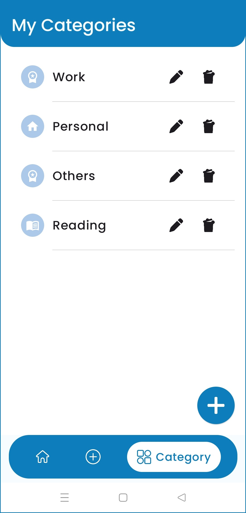
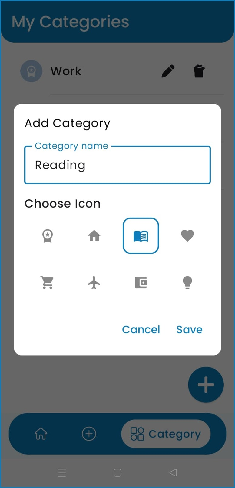

# Taskify-Smart-Todo-Manager

A modern, scalable Android Todo application built using Clean Architecture and the latest Android development best practices.

---

## 📌 Overview

Taskify is a production-ready task management application designed to demonstrate:

- Clean Architecture implementation
- SOLID principles
- MVVM pattern
- Jetpack Compose UI
- Hilt for Dependency Injection
- Room database with KSP
- Background task handling using WorkManager
- Material 3 design system

---

## ✨ Features

| Feature | Feature | Feature | Feature |
|--------|--------|--------|--------|
| ✅ Add new tasks | ✏️ Edit tasks | 🗑 Delete tasks | ✔️ Mark tasks as completed |
| 📂 Manage task categories | 💾 Persistent storage (Room) | ⚡ Optimized compilation (KSP) | 🔄 Background tasks (WorkManager) |
| 🎨 Clean Material 3 UI | 🏷️ Task priority levels | ⏰ Reminder notifications | 🔍 Search & filtering |

---

## 📸 Screenshots

| Home Screen | Add Task Screen | Show Category Screen | Add Category Screen |
|------------|----------------|-------------------|------------------|
|  |  |  |  |

---

## 🏗 Architecture

**Presentation Layer**  
- Jetpack Compose UI  
- ViewModel (MVVM)

**Data Layer**  
- Repository Pattern  
- Room Database  
- DAO

Dependency Injection is handled using Hilt.  
Room database uses Kotlin Symbol Processing (KSP).  
WorkManager handles background tasks.

---

## 🛠 Tech Stack

- Kotlin  
- Jetpack Compose  
- MVVM Architecture  
- Clean Architecture  
- Hilt (Dependency Injection)  
- Room Database  
- KSP (Kotlin Symbol Processing)  
- WorkManager  
- Material 3

---

## 🚀 Future Improvements

- 🌙 Dark mode support  
- ☁️ Firebase cloud sync  
- 📊 Analytics & task statistics  
- 🔔 Daily/weekly summary notifications  
- 🌐 Multi-device sync  
- 📝 Export tasks as PDF/CSV  
- 🔍 Advanced search & filters

---

## 👩‍💻 Author

**Sangita Patel**  
Android Developer (8+ Years Experience)

---

## ⭐ Show Your Support

If you found this project helpful, please give it a ⭐ on GitHub.
